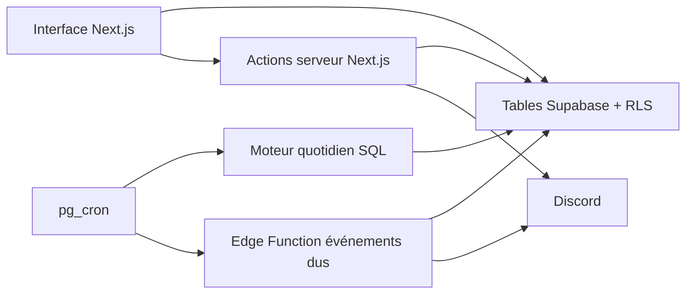

# Audit complet — Fates of Nations

Date : 29 juillet 2026  
Révision auditée : `10f443f` du 28 mars 2026

## Périmètre et niveau de certitude

- **Vérifié** : lecture de l’ensemble du dépôt, compilation, tests unitaires, lint, dépendances, routes, migrations et politiques d’accès.
- **Résultat local** : build réussi, 68 tests réussis, contrôle Edge réussi.
- **Limite** : la base de production n’a pas été inspectée. Docker n’étant pas disponible, les tests locaux Supabase/Playwright n’ont pas pu être rejoués.
- **Conséquence** : “présent” signifie implémenté dans le dépôt, pas forcément déployé ni correctement configuré en production.

---

# Partie 1 — Inventaire fonctionnel copiable sur Discord

## FATES OF NATIONS — CE QUE LE SITE SAIT FAIRE

### 1. Accès

- **Visiteur** : pays, carte, classements, idéologies, wiki et règles.
- **Joueur** : mêmes vues + gestion de son pays.
- **Admin** : gestion du monde, des règles, joueurs, unités, événements et contenus.
- Connexion par email/mot de passe, inscription libre, déconnexion et assignation d’un joueur à un pays.
- Pas de récupération de mot de passe ni de connexion Google/Discord.

### 2. Accueil — liste des pays

- Recherche par pays ou régime.
- Tri par nom, influence, PIB, population ou stabilité.
- Variations récentes issues de l’historique des 14 derniers jours.
- Affichage des sphères, occupations, annexions et contrôles contestés.
- Filtre Tous / Assignés.
- Accès direct à chaque fiche pays.

### 3. Fiche d’un pays

#### Cabinet — joueur/admin

- Rapport synthétique économique, social et militaire.
- Prévision du prochain passage de jour.
- Analyse des dix ministères, de leur financement et de leurs effets.
- Comparaison avec les moyennes mondiales.

#### Généralités — public

- Population, PIB, influence, Hard Power et rangs.
- Militarisme, industrie, science et stabilité.
- Idéologies dominante et secondaires.
- Effets actifs venant du MJ, des lois, avantages, idéologies, IA et voisins.
- Sphère : pays contrôlés, parts, occupation/annexion et contribution à la puissance.

#### Militaire — public avec brouillard de guerre

- Armées Terre, Air, Mer et Stratégique.
- Unités, effectifs, personnel, technologie et Hard Power.
- Renseignement :
  - 0 : aucune donnée ;
  - 1–49 : fourchettes par branche ;
  - 50–99 : fourchettes par unité ;
  - 100 : valeurs exactes.
- Le propriétaire voit son armée complète.
- L’admin peut corriger effectifs supplémentaires et technologie.

#### État-major — joueur/admin

- **Design** : améliore la technologie selon l’industrie, avec limite de science.
- **Recrutement** : produit infanterie/blindés selon militarisme et budget Défense.
- **Procuration** : produit du soutien Terre/Air/Mer via son budget dédié.
- **Stock stratégique** : produit les unités stratégiques selon la science.
- Chaque file progresse au passage du jour puis ajoute un niveau ou une unité.

#### Avantages — public

- Catégories et filtres Actifs/Inactifs.
- Déblocage automatique par conditions cumulatives :
  - statistiques ;
  - PIB ;
  - population ;
  - influence ;
  - niveau de loi.
- Effets appliqués automatiquement tant que les conditions sont remplies.

#### Budget — joueur/admin

- Budget national affiché à partir d’une fraction du PIB.
- Répartition entre dix ministères :
  - État ;
  - Intérieur ;
  - Affaires étrangères ;
  - Recherche ;
  - Éducation ;
  - Santé ;
  - Infrastructure ;
  - Industrie ;
  - Défense ;
  - Procuration militaire.
- Minimums obligatoires, plafond d’allocation et bonus/malus.
- Effets sur PIB, population, statistiques, relations et vitesses d’État-major.
- Prévision du prochain passage de jour.

#### Lois — public, décision joueur/admin

- Cinq lois : mobilisation, industrie terrestre, aérienne, navale et recherche.
- Score de 0 à 500, cinq paliers par loi.
- Le joueur choisit une cible ; le score s’en rapproche chaque jour.
- L’admin peut fixer immédiatement le score.

#### Actions d’État — joueur du pays

- Solde d’actions, coût, cible éventuelle, historique, recherche et pagination.
- Validation/refus par le MJ ; certaines actions exigent d’abord l’accord de la cible.
- Jets d100 de succès et d’impact, avec modificateurs.
- 14 actions :
  - internes : demande d’amélioration, investissements, fortifications ;
  - diplomatie : ouverture, accord, coopération militaire, alliance ;
  - agressives : insulte, prise d’influence, escarmouche, conflit, guerre ;
  - secrètes : espionnage, sabotage.
- Conséquences natives réellement codées :
  - relations pour insulte, ouverture et actions militaires ;
  - part de contrôle pour prise d’influence ;
  - renseignement pour espionnage joueur ;
  - effets libres ajoutés par le MJ.
- Accord, alliance, coopération, sabotage, fortifications et investissements restent surtout des tickets MJ sans système durable propre.

#### Debug — admin

- Détail des effets résolus et données de diagnostic du pays.

### 4. Carte

- Mode **Relations** : couleur rouge/verte selon la relation avec la région choisie.
- Mode **Sphères** : empires, noyaux, occupations, annexions et zones contestées.
- Zoom, déplacement, infobulles, légendes et sélection initiale du pays du joueur.

### 5. Classements

- **Influence** : grandes, moyennes et petites puissances.
- **Militaire** : militarisme et Hard Power par branche.
- **Économie** : population et PIB.
- Affichage de flèches d’évolution de rang.

### 6. Idéologies

- Hexagone de six idéologies :
  - monarchismes germanique et mérinais ;
  - républicanismes français et moghol ;
  - cultismes nilotique et satoiste.
- Trois paires incompatibles.
- Position, dominante, distance au centre et dérive de chaque pays.
- Influence des voisins, relations, puissances et contrôles.
- Filtres joueurs, IA majeures, IA mineures et pays assignés.

### 7. Wiki et règles

- Wiki hiérarchique avec recherche, navigation mobile et liens directs.
- Contenu riche : titres, listes, liens et images.
- Page publique listant la matrice diplomatique et tous les paramètres du moteur.
- La page Règles n’est pas reliée dans la navigation principale.

### 8. Administration

#### Pays

- Création, modification et suppression.
- Nom, URL, régime, continent, drapeau, stats, population et PIB.
- Statut IA majeure/mineure.
- Contrôles territoriaux, occupations et annexions.
- Modification directe des lois.
- Passage manuel du jour.
- Réinitialisation des statistiques et randomisation des budgets/idéologies.

#### Joueurs

- Création de compte, nom, email, mot de passe et pays.
- Réaffectation, renommage et suppression.
- Ajout manuel de 25 Actions d’État.

#### Roster militaire

- Unités Terre/Air/Mer/Stratégique, sous-types, icônes et ordre.
- De 1 à 7 niveaux.
- Personnel, Hard Power, coût de production et science requise par niveau.
- Import et export CSV.

#### Règles du jeu

- Effets mondiaux, date, rythme du monde et pause.
- Croissance, statistiques et budget.
- Cinq lois et leurs paliers.
- État-major.
- Relations, influence et sphères.
- Idéologies et renseignement.
- IA, distances, cibles, fréquence et validation automatique.
- Voisinages de carte.

#### Avantages

- Catégories, icônes, ordre et activation.
- Conditions cumulatives.
- Plusieurs effets par avantage.

#### Actions d’État et demandes

- Types, libellés, coûts et paramètres.
- Lecture des tickets joueurs.
- Modificateurs de jets.
- Effets immédiats, temporaires ou permanents.
- Acceptation, refus et remboursement.

#### Événements IA

- Création manuelle ou automatique.
- Actions autorisées selon IA majeure/mineure.
- Choix des cibles par statut, continent, voisinage ou monde.
- Validation immédiate, différée ou manuelle.
- Traitement et nettoyage des événements.

#### Discord

- Activation par type d’événement.
- Routage national/international et salons par continent.
- Templates, couleurs, images et fragments de texte aléatoires.
- Prévisualisation avant publication.
- Seules les actions acceptées sont publiées.

#### Wiki

- Création, édition, déplacement et suppression des pages.
- Arborescence et éditeur riche avec images.

### 9. Moteur automatique

- Passage quotidien :
  1. historique ;
  2. progression des lois ;
  3. croissance PIB/population et statistiques ;
  4. effets mondiaux, pays, lois, IA, idéologies et avantages ;
  5. effets des ministères ;
  6. journal du calcul ;
  7. État-major ;
  8. gain d’Actions d’État ;
  9. relations automatiques ;
  10. expiration des effets ;
  11. perte de renseignement ;
  12. avancée de la date.
- IA : génération horaire d’événements.
- Événements différés : traitement toutes les dix minutes.
- 35 types d’effets couvrant croissance, stats, budget, armée, influence, relations, idéologie, actions et État-major.

### 10. Limites importantes à connaître

- ⛔ Le moteur quotidien et plusieurs fonctions internes semblent appelables publiquement.
- ⛔ Un secret de l’Edge Function est stocké et affiché dans les règles publiques.
- ⛔ Plusieurs pages admin sont accessibles à tout compte connecté.
- ⛔ Un joueur peut actuellement tricher sur PIB, stats, budget, lois, solde d’actions et renseignement.
- ⛔ Le focus État-major est modifiable anonymement.
- ⛔ Le brouillard militaire masque l’interface, mais pas les données brutes de la base.
- ⛔ La pause n’arrête pas le vrai cron quotidien.
- ⛔ L’idéologie n’est pas enregistrée par le cron principal.
- ⚠️ Un double passage de jour peut appliquer deux fois croissance, effets et productions.
- ⚠️ Les conséquences d’une action peuvent être doublées après panne ou double clic.
- ⚠️ Les mêmes influence et Hard Power peuvent différer entre accueil, classement et fiche.
- ⚠️ Plusieurs effets annoncés par l’interface ne sont pas appliqués par le moteur SQL.
- ⚠️ Les flèches de rang Influence/Hard Power ne reposent pas sur un vrai historique.
- ⚠️ Les actions alliance, coopération, fortifications, investissements et sabotage sont incomplètes.

---

# Partie 2 — Audit critique

## Résumé exécutif

Le projet n’est pas un prototype vide : il contient un moteur de jeu riche, largement configurable, une administration complète et une vraie tentative de centraliser les effets. Le build et les tests actuels passent.

Le problème principal n’est pas le style du code. C’est la **frontière de confiance** : des fonctions, tables, fichiers et pages réservés au moteur ou au MJ sont insuffisamment protégés. Un joueur motivé peut contourner l’interface et modifier la partie.

Le second problème est la **double implémentation des règles** : SQL, Next.js et Edge calculent parfois la même chose différemment. Cela explique les écarts d’influence, les effets affichés mais non appliqués et les régressions lors des migrations.

**Décision recommandée : ne pas faire une réécriture générale.** Sécuriser, figer les résultats actuels par des tests, puis corriger une règle à la fois.

## État technique vérifié

- 391 fichiers dans le dépôt.
- 177 fichiers applicatifs TypeScript/JavaScript, environ 38 100 lignes.
- 152 fichiers de migration et 39 tables métier.
- 19 fichiers applicatifs dépassent 500 lignes.
- Plus gros fichiers :
  - `ReglesForm.tsx` : 2 745 lignes ;
  - `CountryTabStateActions.tsx` : 1 842 ;
  - `CountryTabs.tsx` : 1 304 ;
  - `DemandesList.tsx` : 1 210 ;
  - `CountryTabGeneral.tsx` : 1 134 ;
  - `countryEffects.ts` : 1 045.
- Build Next.js : réussi.
- Tests : 68/68 réussis dans 13 fichiers.
- Couverture : limitée volontairement à cinq fichiers ; 72 % des lignes sur ce petit périmètre, bien moins sur l’application entière.
- Lint : réussi avec 304 avertissements, dont 215 types `any` et 55 variables inutilisées.
- E2E : seulement trois tests de fumée et deux vérifications superficielles du cron.
- Dépendances : 11 vulnérabilités de production signalées, dont 10 hautes ; Next.js 16.1.6 doit être mis à jour.
- Dernière CI GitHub du commit audité : réussie, mais elle ne teste ni les droits réels, ni les parcours gameplay.

## Architecture actuelle

Le SQL est déjà l’autorité principale du passage quotidien. C’est le bon point de départ. Le risque vient des règles parallèles dans Next.js et l’Edge Function.

## Points solides à préserver

- Modèle de jeu riche et majoritairement piloté par les données.
- Registre central des 35 types d’effets dans `countryEffects.ts`.
- Séparation claire des onglets pays et des grands domaines.
- Historique, journaux de calcul et prévisions déjà présents.
- Migrations versionnées et CI avec Supabase local.
- Fonctions pures importantes déjà testées : dés, conséquences, effets, influence, idéologie et prévisions.
- Formatage français centralisé par `formatNumber` et `formatGdp`.
- Authentification vérifiée côté serveur dans plusieurs flux sensibles.

## P0 — À corriger avant toute nouvelle fonctionnalité

### P0.1 — Fonctions de simulation publiques

**Fait vérifié**

Des fonctions `SECURITY DEFINER` modifient la partie avec des droits élevés. Aucune migration ne retire leur droit d’exécution public.

Exemples :

- `run_daily_country_update()` : avance le monde et expire les effets ;
- `run_ai_events_cron(true)` : génère des événements ;
- `run_etat_major_tick()` : produit niveaux et unités ;
- `add_state_actions_from_effects()` : crédite des actions ;
- `apply_relation_delta_effects()` : modifie les relations ;
- `compute_map_region_neighbors()` : vide puis recalcule les voisinages.

**Risque**

Sauf durcissement manuel absent du dépôt, un visiteur peut les appeler par l’API Supabase.

**Recommandation**

Retirer l’exécution à `PUBLIC`, `anon` et `authenticated`, puis n’autoriser que les rôles nécessaires. Ajouter un test automatique des droits.

### P0.2 — Secret Edge exposé

**Fait vérifié**

`process_due_edge_secret` est stocké dans `rule_parameters`, table publiquement lisible. `/regles` affiche toutes les valeurs brutes. L’Edge Function utilise ensuite ce secret avec le service-role.

**Recommandation**

Faire tourner le secret, le déplacer dans Supabase Vault ou un secret Edge, et séparer paramètres publics et privés.

### P0.3 — Protection admin incomplète

**Fait vérifié**

Le middleware exige seulement une connexion. Le vrai contrôle admin couvre uniquement le groupe `(protected)`. Règles, avantages, demandes, événements IA et édition de pays sont en dehors.

Le cas le plus grave est `/admin/demandes`, qui utilise le service-role sans vérifier le rôle. `/admin/pays/[id]` donne à un joueur le formulaire complet de son pays.

**Recommandation**

Mettre toutes les pages admin sous le même layout protégé et faire vérifier `requireAdmin()` par chaque action sensible.

### P0.4 — Écritures joueur trop larges

**Fait vérifié**

Les politiques contrôlent souvent la bonne ligne, mais pas ce que le joueur change :

- `countries` : PIB, population, stats, IA, idéologies et continent modifiables ;
- `country_budget` : fraction, pourcentages et suppression ;
- `country_laws` : score courant modifiable directement ;
- `country_state_action_balance` : solde libre ;
- `state_action_requests` : statut et champs admin insuffisamment contraints ;
- acceptation par la cible : autres colonnes également modifiables.

**Recommandation**

Bloquer les écritures directes et fournir des fonctions transactionnelles étroites : modifier identité, choisir cible de loi, sauvegarder budget, envoyer/répondre à une action.

### P0.5 — Renseignement et État-major manipulables

**Fait vérifié**

- Un bouton “Test” permet à un joueur d’ajouter jusqu’à 100 de renseignement.
- La RLS autorise cette écriture directe.
- `country_etat_major_focus` accepte toute écriture avec `USING (true)`, y compris anonyme.
- Le serveur ne vérifie pas toujours que l’unité choisie correspond à la bonne file.

**Recommandation**

Supprimer le bouton de test, fermer la table et valider pays, file et unité dans une action serveur atomique.

### P0.6 — Fichiers publics vandalisables

**Fait vérifié**

Tout compte connecté peut modifier ou supprimer des drapeaux, icônes d’unités, images d’avantages et images du site. Les images wiki sont partiellement ouvertes.

**Recommandation**

Réserver les écritures à l’admin. Le joueur ne doit pouvoir remplacer que le drapeau de son propre pays, via un chemin imposé.

### P0.7 — Secrets visuels seulement

**Fait vérifié**

Les unités exactes, budgets et focus État-major restent lisibles dans les tables. Les onglets cachés et le brouillard ne protègent que l’écran.

**Décision produit nécessaire**

Définir quelles données doivent être réellement secrètes, puis l’imposer dans la base ou via des vues sûres.

### P0.8 — Dépendances de sécurité

**Fait vérifié**

La version actuelle de Next.js contient des vulnérabilités connues touchant notamment middleware et actions serveur. C’est aggravé par la dépendance actuelle au middleware pour protéger `/admin`.

**Recommandation**

Mettre Next.js à jour dans une branche isolée, sans `audit fix --force`, puis rejouer build, tests, Supabase et E2E.

## P1 — Bugs gameplay et robustesse

### P1.1 — Pause automatique inefficace

Le job pg_cron appelle directement `run_daily_country_update()`. Or `cron_paused` est vérifié seulement par la route HTTP de secours.

**Effet** : le bouton Pause n’arrête pas le vrai moteur automatique.

### P1.2 — Idéologie non persistée par le cron principal

La progression idéologique est enregistrée en TypeScript par le bouton admin et la route HTTP, mais pas par le job SQL principal.

**Effet** : les scores stockés restent figés lors du passage automatique ; l’interface peut afficher une projection comme si elle était déjà appliquée.

### P1.3 — Double passage de jour possible

La fonction quotidienne n’a ni verrou ni identifiant unique de tick.

**Effet** : cron + clic admin, ou deux appels simultanés, peuvent doubler croissance, productions, expiration d’effets et date.

### P1.4 — Actions non atomiques

La création du ticket, le débit, les conséquences, le remboursement et le statut final sont des écritures séparées.

**Effets possibles**

- ticket créé sans débit ;
- deux tickets pour un seul coût ;
- conséquence appliquée deux fois ;
- remboursement perdu ou doublé ;
- événement rejoué après une panne.

**Recommandation**

Une transaction SQL par demande, avec clé d’idempotence et résultat “déjà traité”.

### P1.5 — Jet de succès sans autorité claire

Les conséquences natives et effets MJ sont appliqués même si le jet de succès échoue. Le résultat change surtout le texte Discord.

**Décision produit nécessaire**

Définir si l’échec annule tout, annule seulement l’effet principal ou laisse le MJ décider.

### P1.6 — Refus par la cible probablement non remboursé

La cible tente d’écrire le solde de l’émetteur, ce que sa RLS interdit, puis l’erreur est ignorée.

### P1.7 — Actions incomplètes

Accord, alliance, coopération, sabotage, fortifications et investissements ne créent aucun objet durable. Leur effet dépend d’un ajout manuel du MJ.

### P1.8 — Contrôle territorial non borné

Chaque contrôleur est limité à 100 %, mais la somme des contrôles d’un pays peut dépasser 100 %.

### P1.9 — Moteurs d’effets incohérents

Le registre TypeScript annonce plusieurs sources pour un même effet, mais le SQL quotidien en ignore certaines.

Exemples vérifiés :

- bonus État-major : affichage toutes sources, SQL surtout effets pays + budget ;
- `state_actions_grant` et `relation_delta` : certaines sources affichées mais non appliquées ;
- lois : l’écran utilise parfois la cible immédiatement, le cron utilise le score courant ;
- multiplicateurs d’influence d’avantages/IA/idéologie partiellement ignorés.

### P1.10 — Budget incohérent

- Procuration existe comme dixième ministère, mais manque dans la vue générale des effets budgétaires.
- Le ministère d’État annonce un gain d’Actions d’État que le moteur budget filtre.
- `budget_ministry_effect_multiplier` est affiché mais non appliqué.
- L’interface peut annoncer un plafond supérieur à 100 %, la base bloque toujours à 100 %.
- `budget_fraction` change le montant affiché, mais pas les formules du moteur.

### P1.11 — Militaire incomplet

- `military_unit_tech_rate`, ancien gain quotidien de technologie, a disparu du dernier cron.
- Les limites militaires servent surtout à l’affichage et ne bloquent pas réellement les sauvegardes.
- Certains effets de “limite” augmentent aussi le nombre effectif, mélangeant capacité et unités réelles.

### P1.12 — IA divergente

- Trois processeurs d’événements dus : route Next, action admin et Edge Function.
- Le code partagé n’est que partiellement synchronisé.
- Les seuils de relations des actions militaires ont régressé dans une réécriture du cron IA.
- L’espionnage IA ne donne pas de renseignement.
- Le traitement Edge peut s’arrêter silencieusement si une configuration serveur manque.

### P1.13 — Influence et Hard Power différents selon la page

Accueil, classement, fiche et idéologie n’agrègent pas exactement les mêmes effets.

**Effet** : un même pays peut avoir plusieurs valeurs officielles.

### P1.14 — Classements trompeurs

- Les flèches de rang Influence/Hard Power reposent sur un rang reconstitué, pas un historique réel.
- Le classement Hard Power total est calculé mais non affiché.

### P1.15 — Filtres joueurs incomplets

La RLS empêche les pages publiques de connaître l’ensemble des pays joueurs. Les filtres Assignés/Joueurs peuvent donc être faux.

### P1.16 — Carte multi-pays simplifiée

Une région liée à plusieurs pays ne conserve qu’un seul statut de contrôle à l’affichage.

### P1.17 — Discord non garanti

Les envois sont lancés sans attente, sans file, sans statut et sans nouvelle tentative.

**Effet** : le gameplay peut réussir mais le message disparaître.

## P2 — Structure et maintenabilité

### P2.1 — Fonctions et composants géants

Les plus gros écrans mélangent chargement, calcul, formulaires, modales et mutations. La fonction quotidienne SQL a été réécrite intégralement dans de nombreuses migrations.

**Recommandation**

Découper seulement selon les sections métier existantes, après les tests de comportement. Pas de framework interne générique.

### P2.2 — Types de base maintenus à la main

Les clients Supabase n’utilisent pas le type `Database` généré. Les migrations et TypeScript peuvent diverger sans erreur claire.

### P2.3 — Erreurs ignorées

Plusieurs lectures/écritures transforment une erreur en liste vide ou continuent le traitement. C’est dangereux dans les flux argent, actions, relations et Discord.

### P2.4 — Tests trop étroits

Il manque des tests pour :

- droits visiteur/joueur/admin ;
- stockage ;
- RPC publiques ;
- tick réel et pause ;
- lois/budget/État-major ;
- envoi et remboursement d’actions ;
- concurrence et double traitement ;
- brouillard de guerre ;
- cohérence des valeurs entre pages.

### P2.5 — Fiche pays coûteuse

Environ 31 requêtes Supabase sont lancées. Plusieurs ensembles mondiaux sont chargés deux fois.

**Recommandation**

Mesurer avant d’optimiser ; le monde peut rester assez petit pour que ce coût soit acceptable.

### P2.6 — Exploitation minimale

- Pas de journal fiable de chaque exécution du cron.
- Pas d’alerte ni suivi central des erreurs.
- Pas de `error.tsx`/`global-error.tsx`.
- Pas de mécanisme de reprise Discord.

### P2.7 — Accessibilité et mobile

- Modales artisanales sans gestion complète du clavier et du focus.
- Navigation horizontale susceptible de déborder sur mobile.
- Plusieurs images sans optimisation ni texte alternatif utile.

### P2.8 — Éléments morts ou trompeurs

- `country_macros` chargé mais inutilisé.
- `country_perks` et `unlockedPerkIds` devenus sans effet.
- `country_mobilisation` remplacé par `country_laws`.
- `IdeologieHeader.tsx` retourne toujours `null`.
- `/admin/matrice-diplomatique` est un simple renvoi.
- `rp-app-gitignore-backup` est un fichier résiduel.
- Le wiki parle encore d’un triangle idéologique.
- Une nouvelle clé d’Action d’État reste invisible sans modifier le code.
- `params_schema` ne génère pas réellement de formulaire dynamique.
- Migrations de données “test” ou destructives encore dans l’historique : relations remises à zéro, pays factices, Russie de test, technologie forcée.

## Audit Ponytail — ce qui peut disparaître

delete: supprimer `rp-app-gitignore-backup` après vérification finale  
delete: retirer `@tiptap/extension-link`, `happy-dom` et `vite` si les tests confirment qu’ils sont inutiles  
delete: supprimer les doublons de tests placés à la fois dans `src/lib` et `src/lib/__tests__`  
shrink: unifier les calculs monde dans un seul snapshot partagé  
shrink: remplacer les contrôles admin répétés par un unique `requireAdmin`  
shrink: fusionner les trois processeurs d’événements dus  
native: utiliser `<dialog>` pour les modales simples  
yagni: ne pas créer de nouvelle couche “moteur générique” avant d’avoir figé les règles  
net: environ -300 lignes et -3 dépendances directes possibles, hors simplification du moteur

---

# Plan de refactor sans régression

## Phase 0 — Sauvegarder la réalité

1. Sauvegarde complète de la base de production.
2. Export anonymisé d’un petit monde représentatif.
3. Vérification des migrations réellement appliquées et des droits ajoutés manuellement.
4. Capture des résultats actuels :
   - un tick ;
   - chaque loi ;
   - chaque ministère ;
   - chaque file État-major ;
   - chaque Action d’État ;
   - influence/Hard Power sur chaque page.
5. Gel des valeurs d’équilibrage pendant le refactor.

**Sortie attendue** : un jeu de référence permettant de prouver “mêmes entrées, mêmes sorties”.

## Phase 1 — Correctif de sécurité isolé

1. Rotation et déplacement du secret Edge.
2. Droits explicites sur toutes les RPC.
3. Toutes les pages admin sous une protection unique.
4. Suppression du bouton de renseignement de test.
5. Fermeture des RLS joueurs trop larges.
6. Fermeture des buckets Storage.
7. Mise à jour de Next.js et dépendances vulnérables.
8. Tests d’attaque visiteur, compte libre, joueur et admin.

**Aucun changement d’équilibrage dans cette phase.**

## Phase 2 — Filet anti-régression

1. Tests de la matrice des rôles :
   - visiteur ;
   - connecté sans pays ;
   - joueur propriétaire ;
   - joueur étranger ;
   - admin.
2. Tests SQL du tick complet sur le monde de référence.
3. Tests concurrence :
   - deux passages de jour ;
   - deux envois d’action ;
   - deux acceptations ;
   - reprise après erreur.
4. Parcours E2E joueur :
   - budget ;
   - lois ;
   - État-major ;
   - renseignement ;
   - Actions d’État.
5. Comparaison automatique accueil/classement/fiche pour influence et Hard Power.

## Phase 3 — Rendre les mutations atomiques

1. Verrou et identifiant unique pour chaque tick.
2. Une transaction pour soumettre et débiter une action.
3. Une transaction idempotente pour accepter/refuser et appliquer les conséquences.
4. Somme des contrôles validée selon la règle produit.
5. Validation stricte des unités, cibles, coûts et statuts.

## Phase 4 — Réconcilier le moteur

1. Écrire la matrice officielle **effet × source × système**.
2. Choisir une valeur officielle pour influence et Hard Power.
3. Corriger :
   - pause ;
   - idéologie ;
   - budget ;
   - lois ;
   - État-major ;
   - IA ;
   - renseignement.
4. Supprimer les affichages de règles non réellement appliquées, ou implémenter ces règles après décision produit.
5. Garder PostgreSQL comme autorité du passage quotidien.

## Phase 5 — Réduire la duplication

1. Un seul processeur d’événements dus.
2. Types Supabase générés.
3. Chargement monde partagé pour accueil, classement et fiche.
4. Découpage des gros composants selon leurs sections actuelles.
5. Suppression des tables, dépendances, tests et écrans morts confirmés.

## Phase 6 — Exploitation et finition

1. Journal d’exécution du cron avec durée, succès et identifiant de tick.
2. File Discord avec nouvelles tentatives si la livraison doit être garantie.
3. Pages d’erreur et suivi des incidents.
4. Accessibilité clavier, mobile et formatage français.
5. Politique de conservation des historiques, logs et événements.

## Règles de livraison

- Petites migrations et petites pull requests.
- Une sauvegarde et un chemin de retour pour chaque changement de données.
- Aucune modification d’équilibrage mélangée à un refactor.
- Comparaison automatique avant/après sur le monde de référence.
- Déploiement sécurité avant nettoyage esthétique.
- Pas de réécriture totale.

---

# Blindspots — décisions cachées à traiter

## Landmines

- La base live peut contenir des droits ou fonctions absents des migrations.
- Les secrets déjà publics doivent être considérés compromis, même après masquage.
- Les migrations historiques contiennent des données de test et des remises à zéro.
- Modifier le moteur sans capturer les résultats actuels changerait silencieusement l’équilibrage.
- Fermer les lectures publiques peut casser les pages qui interrogent directement les tables.

## Hidden context

- Données réellement secrètes entre joueurs.
- Autorité exacte du jet de succès et du MJ.
- Sens métier d’alliance, coopération, sabotage et fortifications.
- Rôle réel de la dette, de `budget_fraction` et des plafonds supérieurs à 100 %.
- Garantie attendue pour Discord.
- État réel de Supabase, Vercel, cron et secrets de production.

## What good looks like

- Un visiteur ne peut déclencher aucune mutation.
- Un joueur ne peut modifier que les choix explicitement offerts par le jeu.
- Un tick et une action sont appliqués exactement une fois.
- Toutes les pages affichent la même puissance pour un même pays.
- Toute règle visible est réellement appliquée et testée.
- Le gameplay avant/après reste identique sauf corrections approuvées.

## Questions you should be asking

L’entretien doit couvrir, dans cet ordre : confidentialité, droits joueur, rythme du monde, actions et jets, contrôle territorial, budget, lois, armée, avantages, idéologie, IA, Discord, administration, historique et exploitation.

Ces décisions seront posées **une par une** afin d’éviter des réponses rapides mais contradictoires.

## Rewritten request

> Cartographier toutes les fonctions réellement présentes dans Fates of Nations, distinguer ce qui fonctionne, ce qui est incomplet et ce qui est dangereux, puis sécuriser et simplifier l’architecture sans changer l’équilibrage. Avant chaque correction de gameplay, capturer le comportement actuel, obtenir une décision produit explicite et ajouter un test empêchant toute régression.
